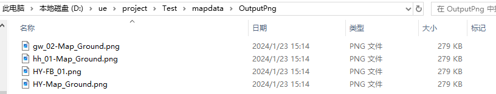
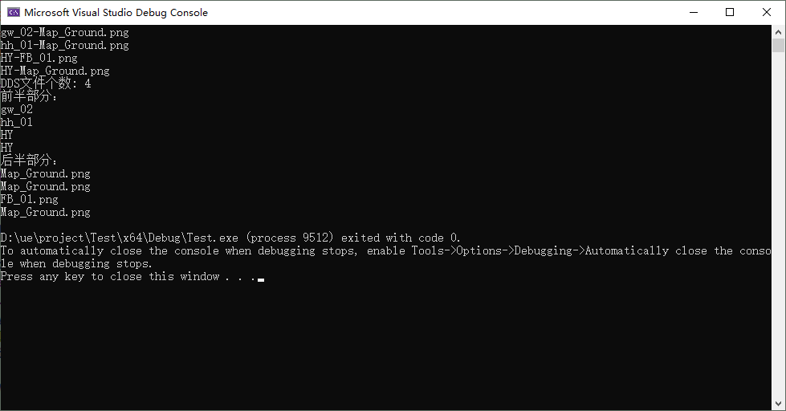

```c
#include <iostream>
#include <vector>
#define STB_IMAGE_IMPLEMENTATION
#include "stb_image.h"
#include <sstream>
#include <filesystem>

using namespace std;
namespace fs = std::filesystem;

int main() {
    std::string folderPath = "./mapdata/OutputPng"; // 当前文件夹路径

    int ddsFileCount = 0;
    std::vector<std::string> fileNames;
    for (const auto& entry : fs::directory_iterator(folderPath)) {
        if (entry.is_regular_file() && entry.path().extension() == ".png") {
            // 如果是普通文件且后缀为.DDS，则增加计数
            ddsFileCount++;
            cout << entry.path().filename().string() << endl;
            fileNames.push_back(entry.path().filename().string());
        }
    }

    std::cout << "DDS文件个数: " << ddsFileCount << std::endl;

    std::vector<std::string> originalStrings = { "gw_02-Map_Ground.png", "hh_01-Map_Ground.png", "HY-FB_01.png", "HY-Map_Ground.png" };
    std::vector<std::string> beforeDash;
    std::vector<std::string> afterDash;

    for (const auto& str : originalStrings) {
        std::stringstream ss(str);
        std::string token;

        // 使用'-'分割字符串
        if (std::getline(ss, token, '-')) {
            beforeDash.push_back(token);
        }

        if (std::getline(ss, token, '-')) {
            afterDash.push_back(token);
        }
    }

    // 输出结果
    std::cout << "前半部分：" << std::endl;
    for (const auto& before : beforeDash) {
        std::cout << before << std::endl;
    }

    std::cout << "后半部分：" << std::endl;
    for (const auto& after : afterDash) {
        std::cout << after << std::endl;
    }

    return 0;
}


```

