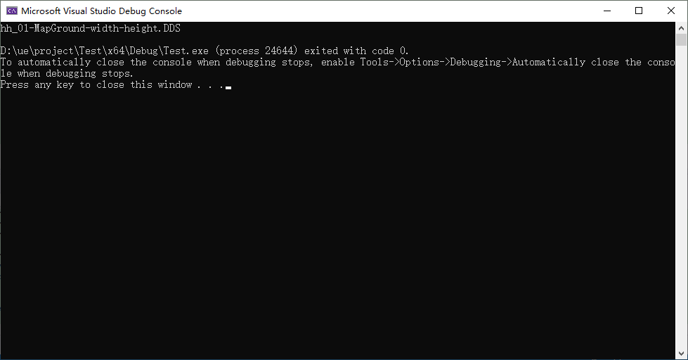

```c
#include <iostream>
#include <string>

int main() {
    std::string originalString = "hh_01-MapGround.DDS";

    // 获取字符串的位置，用于插入
    size_t insertPos = originalString.find_last_of('.');

    // 在字符串的 "." 之前插入 "-width-height"
    std::string modifiedString = originalString.substr(0, insertPos) + "-width-height" + originalString.substr(insertPos);

    // 输出修改后的字符串
    std::cout << modifiedString << std::endl;

    return 0;
}

```

