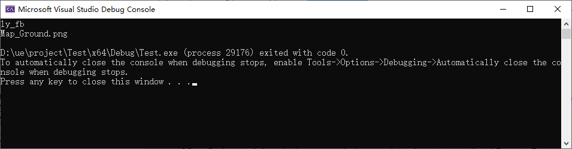

```c
#include <iostream>
#include <sstream>
#include <vector>

int main() {
    std::string input = "../../AuraClient/mapdata/ly_fb/Map_Ground.png";

    // 找到"mapdata/"后的子串
    size_t startPos = input.find("mapdata/");
    std::string remaining = input.substr(startPos + 8);

    // 使用stringstream按"/"进行拆分
    std::vector<std::string> result;
    std::stringstream ss(remaining);
    std::string token;
    while (std::getline(ss, token, '/')) {
        result.push_back(token);
    }

    // 输出结果
    for (const auto& str : result) {
        std::cout << str << std::endl;
    }

    return 0;
}

```



